# 🍋 Little Lemon – Restaurant App Prototype

A modern, Jetpack Compose-based Android prototype for a fictional restaurant, built as part of the
Meta Android Developer Professional Certificate program. This app demonstrates key features like
menu browsing, user authentication, Firestore integration, and role-based admin control.

---

## 🚀 Features

- **Home Screen**: Info about restaurant and some special dishes.
- **Menu Browsing**: Explore a variety of dishes with images and descriptions.
- **Dish Details**: View full descriptions and images of individual dishes.
- **User Authentication**: Sign in and register using Firebase Auth.
- **Favorites**: Heart dishes to save them to your personal favorites list.
- **Category Filtering**: Filter dishes by categories like Starters, Main Course, Desserts, and
  Beverages.
- **Admin Panel**: Role-based access to add, edit, or delete dishes directly from the app.
- **Persistent Login**: Stay signed in across sessions using local storage.
- **Firestore Integration**: Real-time data syncing for dishes and user profiles.
- **Firebase Storage**: Store and retrieve dish images efficiently.

---

## 🛠️ Tech Stack

- **Language**: Kotlin
- **UI Framework**: Jetpack Compose
- **Backend**: Firebase (Auth, Firestore, Storage)
- **Image Loading**: Coil
- **Navigation**: Navigation Compose

---

## Screenshots

### Basic UI

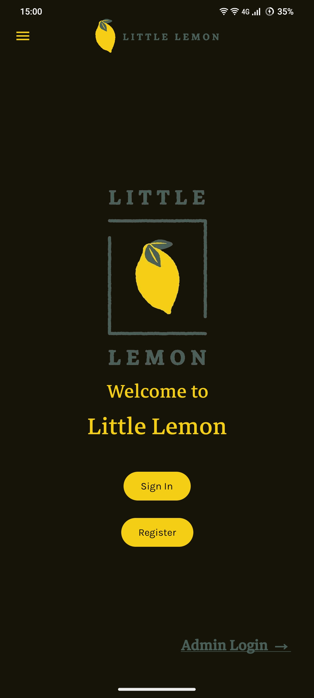

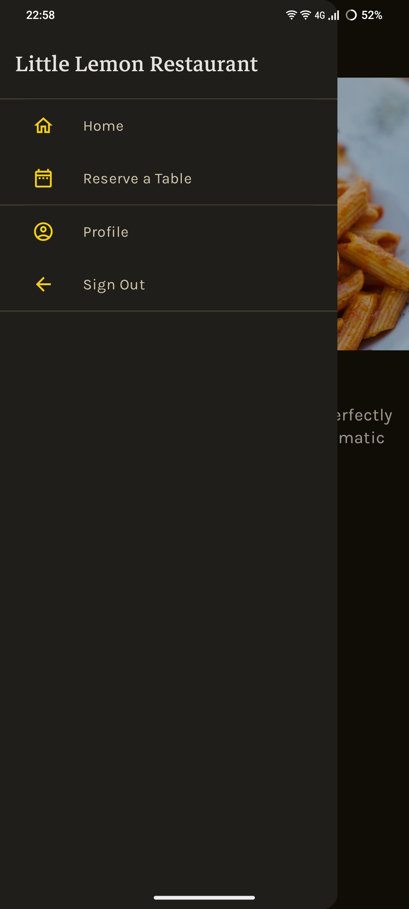

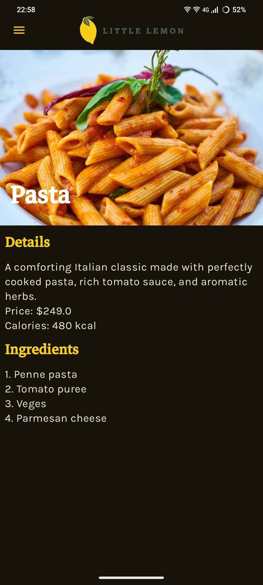

### User Authentication and Profile

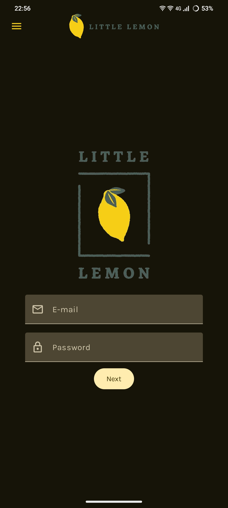

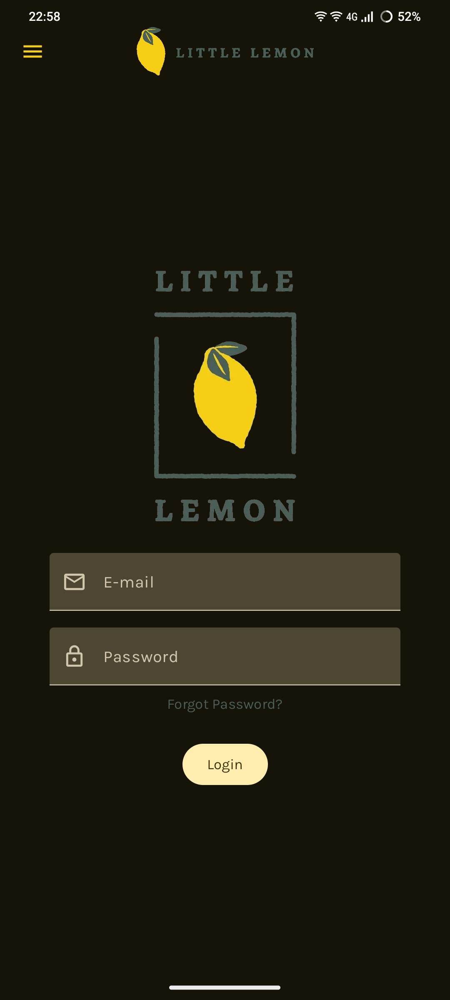

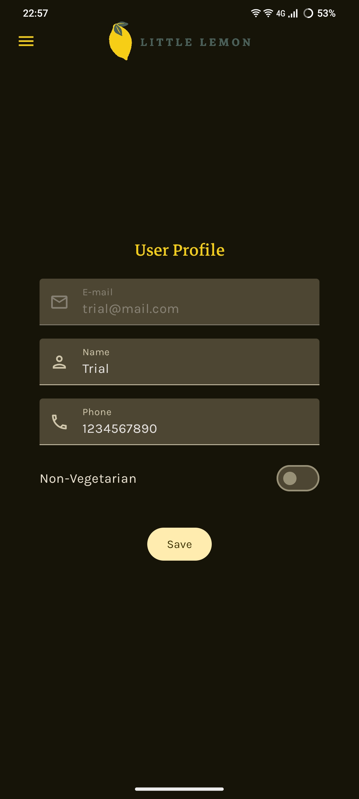

### User Experience

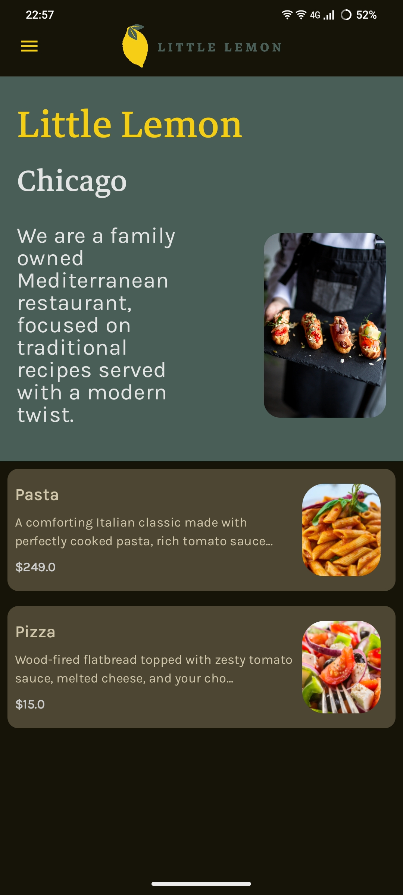

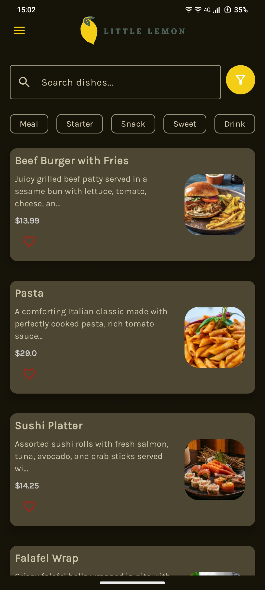

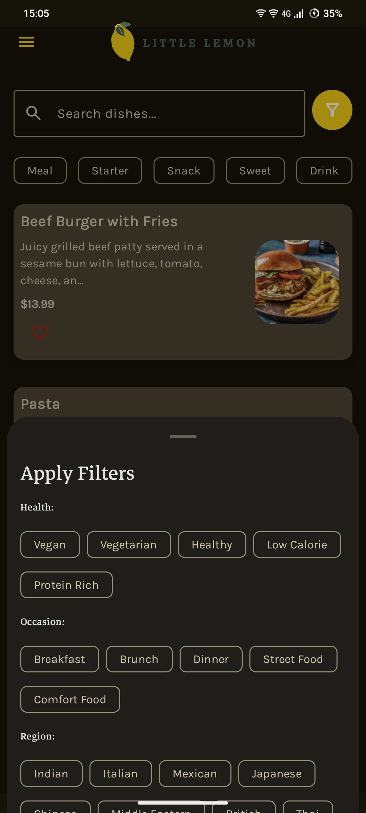

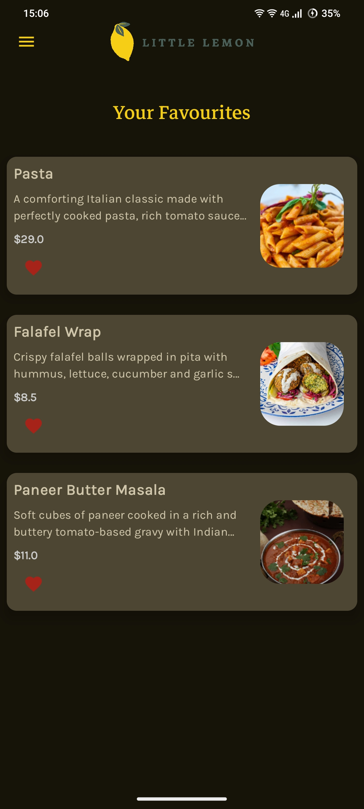

### Admin Features

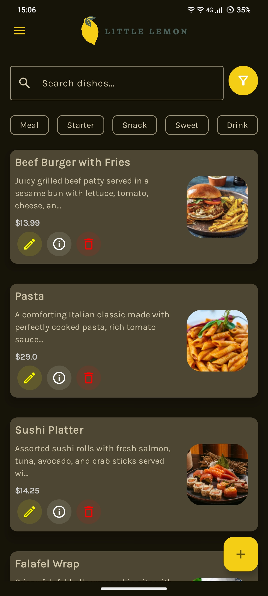

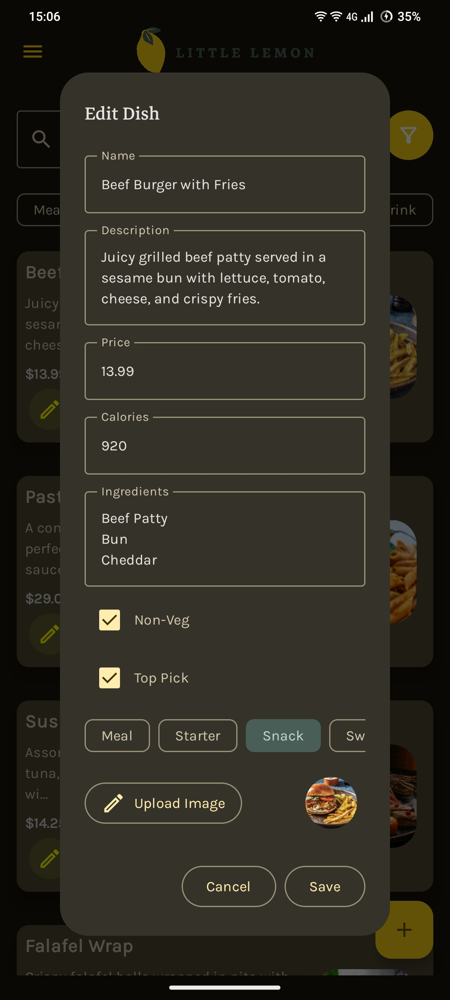

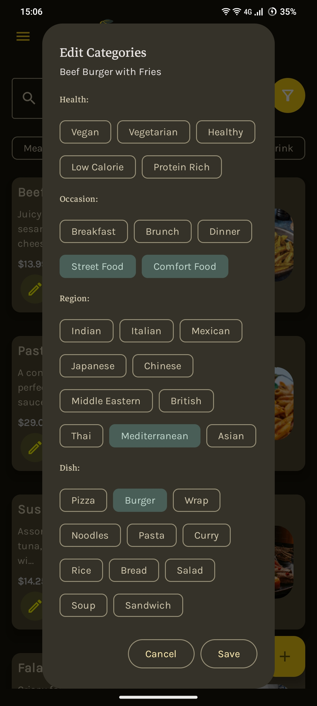

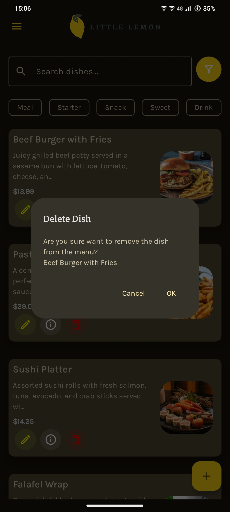

 

---

⭐️ From [Jaguar000212](https://github.com/Jaguar000212)
