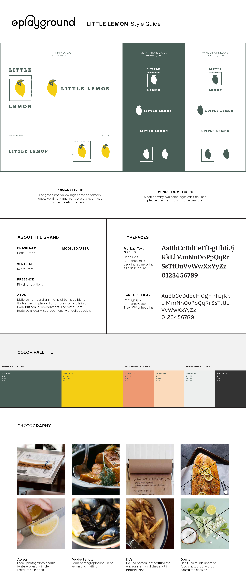
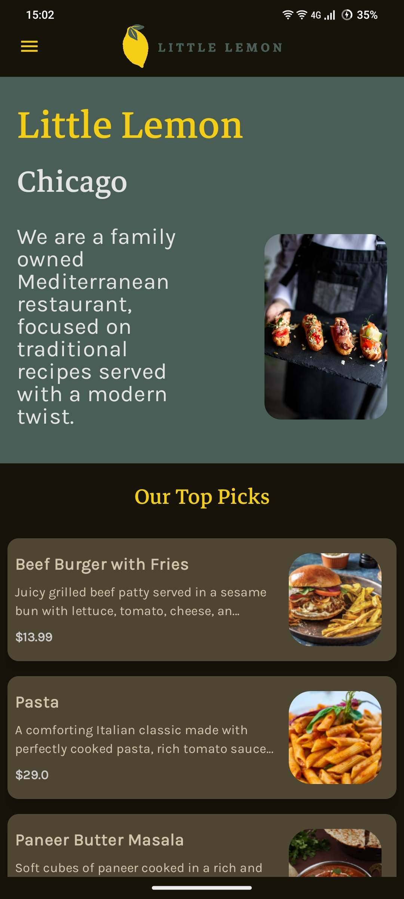
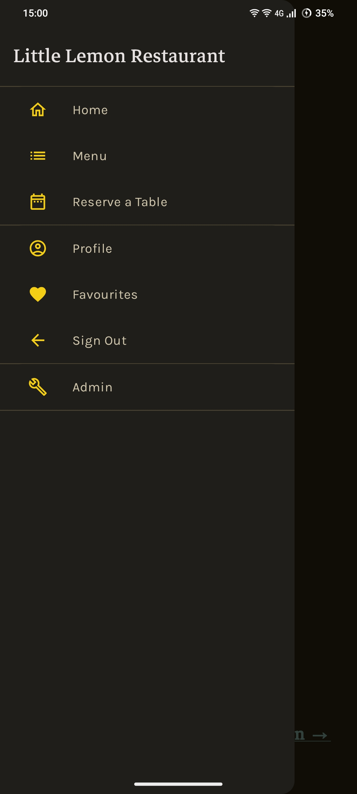

# 🍋 Little Lemon – Restaurant App Prototype

A modern, Jetpack Compose-based Android prototype for a fictional restaurant, built as part of the Meta Android Developer Professional Certificate program. This app demonstrates key features like menu browsing, user authentication, Firestore integration, and role-based admin control.

---

## 🚀 Features

- **Home Screen**: Browse all dishes with images, names, and prices.
- **Dish Details**: View full descriptions and images of individual dishes.
- **User Authentication**: Sign in and register using Firebase Auth.
- **Favorites**: Heart dishes to save them to your personal favorites list.
- **Category Filtering**: Filter dishes by categories like Starters, Main Course, Desserts, and Beverages.
- **Admin Panel**: Role-based access to add, edit, or delete dishes directly from the app.
- **Persistent Login**: Stay signed in across sessions using local storage.
- **Firestore Integration**: Real-time data syncing for dishes and user profiles.

---

## 🛠️ Tech Stack

- **Language**: Kotlin
- **UI Framework**: Jetpack Compose
- **Backend**: Firebase (Auth, Firestore)
- **Image Loading**: Coil
- **Navigation**: Navigation Compose

---
## Screenshots

 

---

⭐️ From [Jaguar000212](https://github.com/Jaguar000212)
